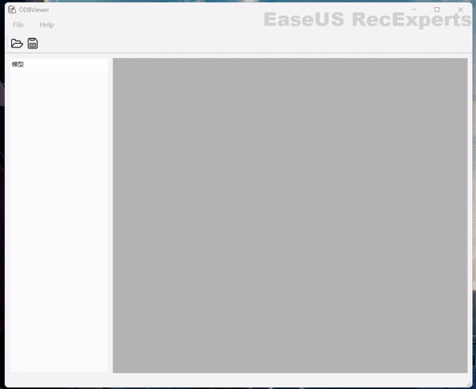

# ODBViewer

## 声明
- 本项目为作者个人学习项目，不保证稳定性与功能性。如果您需要对ODB文件进行可视化操作，建议您使用HyperView等专业软件，或者使用[odb2vtk](https://github.com/Arris-Composites/ODB2VTK)脚本将ODB文件转换为VTK格式后使用ParaView等软件进行可视化操作。

- 编译提示：Abaqus ODB API 头文件在 MSVC 的标准严格模式（`/permissive-`）下兼容性较差，可能出现大量语法或模板相关错误。请为 `odbmanager.h/cpp` 保持编译器的宽松模式以确保正常编译。

## 项目介绍
本项目基于 Qt 6.9 和 VTK 9.5 开发，支持 Abaqus ODB 文件的后处理查看。目前该项目完成了以下功能：

- 打开 Abaqus ODB 文件并显示基础几何（面/线框）
- 加载场变量（U/UR/S），按需显示云图与色标
- 位移/旋转支持点模长显示（Magnitude）
- 导出当前选中帧的模型数据和场数据为 `*.vtu`
- 基础交互：qt界面、坐标轴、标量色标

## 目录结构与架构概览
- `mainwindow.*`：Qt UI 入口与交互逻辑
  - `openFile()` 选择并打开 ODB，显示基础几何
  - `onTreeItemActivated()` 加载并显示选中场变量
  - `saveFile()` 保存当前帧数据为 `*.vtu`
- `odbmanager.*`：对 Abaqus ODB API 的封装
  - 读取实例/节点/单元几何，维护缓存，可释放/重载以节省内存
  - 读取步与帧、字段（U/UR/S），统一数据结构 `FieldData`
- `creategrid.*`：构建 `vtkUnstructuredGrid` 与场数据数组
  - 将 ODB 几何映射到 VTK 节点与单元；支持添加场数据、计算 Von Mises应力
- `vtkdisplay.*`：VTK 渲染与标量显示管理
  - 支持实体/线框显示、激活标量场、色标、相机视角、坐标轴
- `CMakeLists.txt`：项目构建脚本

## 环境要求
- 操作系统：Windows（MSVC/Visual Studio 2022）
- 必需：CMake ≥ 3.19、Qt 6.9（Core、Widgets）、VTK 9.5
- 注意：Abaqus为商业软件，在开始读取读取ODB文件之前，请确保已安装Abaqus 2022并配置好环境变量。

## 使用说明
- 打开文件：菜单栏选择“Open ODB File”，载入 `.odb`
- 浏览数据：左侧树包含“实例”“步与帧”“场变量”，点击帧（需要按下Enter键）可切换当前帧；点击场变量（需要按下Enter键）可加载并显示云图
- 显示规则：
  - 位移/旋转（U/UR）默认计算点模长并着色
  - 应力（S）当前默认显示张量的第一个分量
- 导出：菜单“Save”将当前帧的已加载场数据写出为 `*.vtu`

## 示例数据
本仓库包含一个test.odb文件，您可以使用该文件进行测试

## 已知问题
目前项目还存在诸多问题，由于作者精力有限且时间紧迫，以下问题将在后续逐步修复：
- 云图显示不对：目前项目的云图显示不正确，无法做到和标准结果相同
- 打开效率偏低：目前作者缺少数模测试数据，无法进行效率测试。
- 项目架构简单：目前项目架构简单，功能模块之间的耦合度较高，后续会考虑进行优化。
- 文件导出功能不完整：目前项目的文件导出功能只支持导出当前选中帧的模型数据和场数据，后续会考虑增加导出所有帧数据的功能。

## Roadmap
- 云图显示优化：后续会修复云图显示问题，使其与标准结果相同。
- UI 界面优化：增加UI界面的功能，添加类似Abaqus后处理模块的逐步显示功能。
- 性能优化：优化网格加载部分代码的逻辑，提升加载效率。
- 文档与演示：补充截图/动图与更详细的环境配置说明

## 依赖与许可合规
- 本仓库仅包含作者编写的源码；不分发任何 Abaqus 的头文件、库或安装包
- 使用本项目的 ODB 读取功能需要你本机已安装 Abaqus 并拥有合法许可
- Qt 与 VTK 的许可请遵循各自官方条款